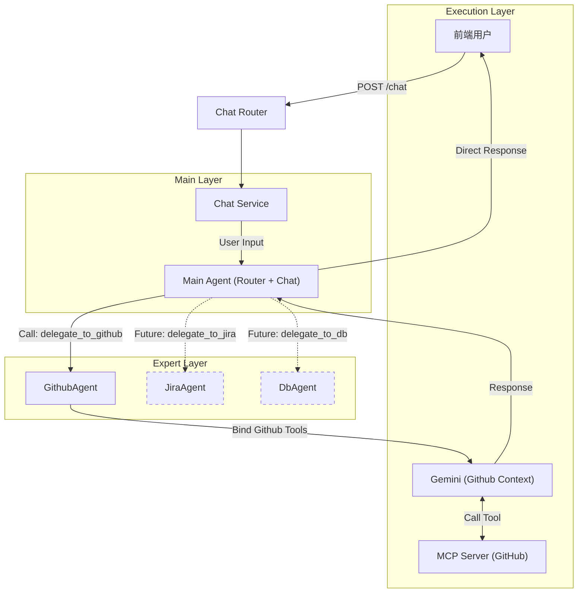

# Design Document: MCP Integration - Option 3 (Hierarchical Agents)

## 1. 核心理念

本方案采用 **"Hierarchical Agents" (分层代理)** 模式，严格遵循 **单一职责原则 (SRP)**。

我们将系统拆分为两个层级：
1.  **Router Layer (主管)**：负责意图识别和分发，不处理具体业务。
2.  **Expert Layer (专家)**：负责具体领域的任务执行。例如 `GithubAgent` 只负责 GitHub 操作，`ChatAgent` 只负责通用对话。

这种架构既保留了方案二的“自动路由”体验（前端无感），又具备方案一的“代码隔离”优势（易维护）。

## 2. 架构设计

### 2.1 架构图 (Mermaid)

### 2.2 核心组件

1.  **`MainAgent` (Router + Chat)**:
    *   **职责**: 处理通用对话，并决定是否将任务移交给专家。
    *   **Tools**: 挂载 `delegate_to_github` 工具（Hand-off）。
    *   **Prompt**: "You are a helpful assistant. For GitHub tasks, use the `delegate_to_github` tool."
2.  **`GithubAgent` (Expert)**:
    *   **职责**: 专注于 GitHub 操作。
    *   **Tools**: 挂载 `get_repo_list` 等真实 MCP 工具。
    *   **Prompt**: "You are a GitHub expert. Use the provided tools to answer queries."
3.  **`BaseAgent` Interface**:
    *   定义标准接口，支持 Agent 间的嵌套调用。

## 3. 开发计划

### Phase 1: 基础建设
- [ ] **Dependencies**: 安装 `mcp` Python SDK。
- [ ] **Config**: 配置 MCP 连接信息。
- [ ] **Interface**: 定义 `src/agents/base.py`。

### Phase 2: 实现专家代理
- [ ] **GithubAgent**: 创建 `src/agents/github_agent.py`，实现 MCP 连接和工具绑定。
- [ ] **ChatAgent**: 创建 `src/agents/chat_agent.py`，实现基础对话逻辑。

### Phase 3: 实现路由层
- [ ] **Router**: 创建 `src/services/intent_router.py`，实现意图分类逻辑。
- [ ] **Integration**: 修改 `ChatService`，先调用 Router 获取意图，再分发给对应 Agent。

### Phase 4: 验证
- [ ] **Test**: 编写测试用例，验证 "你好" 路由到 ChatAgent，"列出 repo" 路由到 GithubAgent。

## 4. 优缺点分析

| 维度 | 评价 | 理由 |
| :--- | :--- | :--- |
| **可控性** | ⭐⭐⭐⭐⭐ | 路由逻辑独立，易于调试和干预。 |
| **隔离性** | ⭐⭐⭐⭐⭐ | 完美的 SRP 实践，专家之间互不干扰。 |
| **用户体验** | ⭐⭐⭐⭐⭐ | 前端无感，自动智能响应。 |
| **复杂度** | ⭐⭐⭐ | 比单一 Agent 稍微复杂，多了一次 LLM 调用（Router），可能会增加少量延迟。 |
