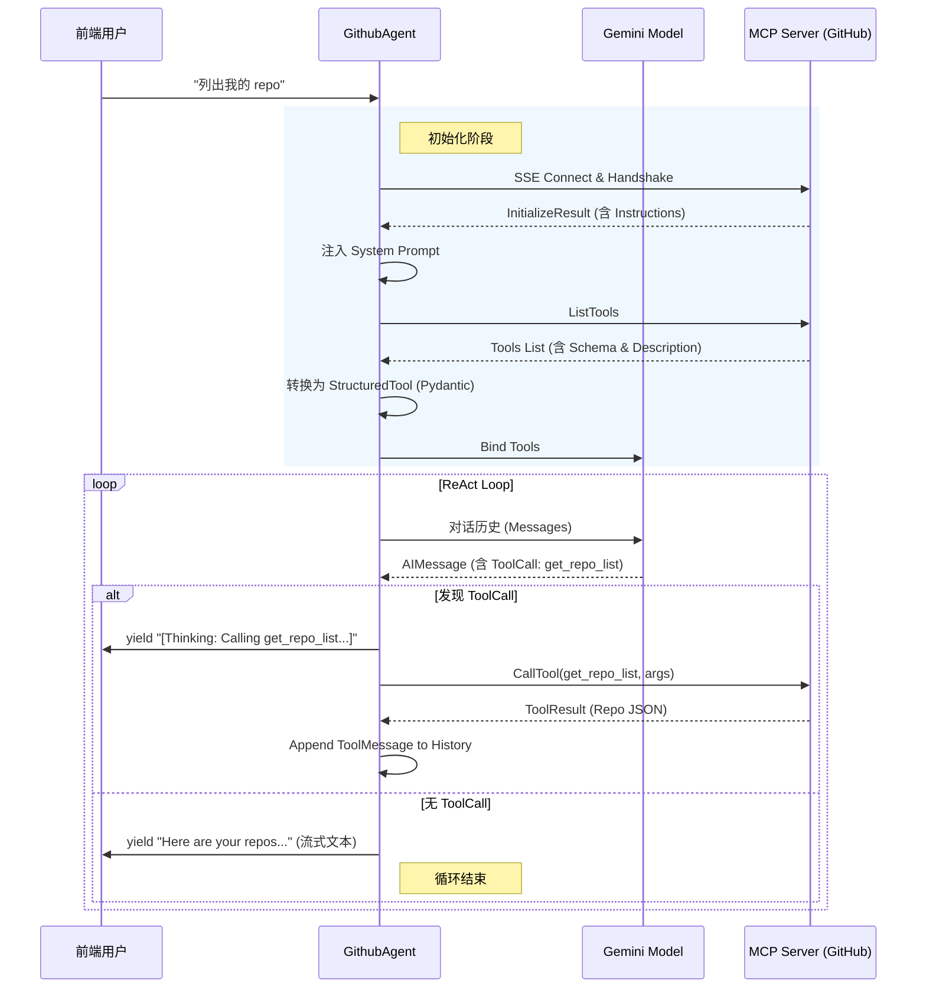
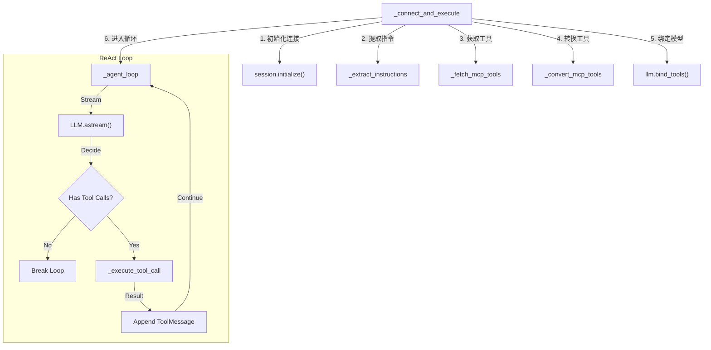

# 构建 Cline 级智能体：LangChain 与 MCP Server 的深度集成实战

本文档详细复盘了我们如何基于 LangChain 构建一个能够连接 Model Context Protocol (MCP) Server 的智能 Agent (`GithubAgent`)。我们的目标是复刻 Cline 等先进 IDE 插件的核心能力：**自动工具发现**、**自动规则注入**以及**智能工具调用**。

## 1. 架构概览：GithubAgent 的解剖

`GithubAgent` 不仅仅是一个简单的 LLM 包装器，它是一个具备完整 **思考-行动-观察 (ReAct)** 循环的自治单元。

### 1.1 调用链路图



### 1.2 Agent 内部方法调用流 (Internal Flow)

为了更清晰地展示代码结构，我们将 `GithubAgent` 内部的方法调用关系绘制如下：



## 2. 核心方法详解

为了实现上述架构，我们将 `GithubAgent` 拆分为五个单一职责的核心方法。

### 2.1 `_fetch_mcp_tools`: 工具发现
**代码职责**：连接 MCP Server，拉取原始工具定义。
```python
    async def _fetch_mcp_tools(self, session: ClientSession) -> List[McpTool]:
        logger.info("Fetching tools from MCP...")
        result = await session.list_tools()
        return result.tools
```
**解释**：这是实现“自动发现”的第一步。无论 Server 端增加了什么新工具，Agent 只要重启就能看到。

### 2.2 `_convert_mcp_tools`: 智能适配器
**代码职责**：将 MCP 的 JSON Schema 转换为 LangChain `StructuredTool`。
**关键技术**：`pydantic.create_model`。
```python
    def _convert_mcp_tools(self, mcp_tools: List[McpTool], session: ClientSession) -> List[StructuredTool]:
        # ... 遍历 mcp_tools ...
        args_model = create_model(f"{tool.name}Schema", **fields)
        return StructuredTool.from_function(..., args_schema=args_model)
```
**解决的问题**：这是解决“参数对齐”的关键。它确保 LLM 知道参数名是 `owner` 而不是 `username`。

### 2.3 `_extract_instructions`: 规则注入
**代码职责**：从握手响应中提取 Server 端的 `instructions`。
```python
    def _extract_instructions(self, init_result: Any) -> str:
        if hasattr(init_result, 'instructions') and init_result.instructions:
            return f"\n\n[Server Instructions]\n{init_result.instructions}"
        return ""
```
**解决的问题**：Cline 能读懂 Server 的“潜规则”（如“别用浏览器”），靠的就是这一步。我们将这些规则强行注入到了 System Prompt 中。

### 2.4 `_agent_loop`: 大脑回路
**代码职责**：维护 ReAct 循环，处理流式输出与工具调用的分流。
```python
    async def _agent_loop(self, llm_with_tools, session, messages):
        while True:
            # 1. 思考 (Think)
            async for chunk in llm_with_tools.astream(messages):
                # ... 累加 chunk ...
                if chunk.content: yield chunk # 实时输出文本
            
            # 2. 决策 (Decide)
            if not getattr(final_chunk, 'tool_calls', None): break # 没工具用，结束
            
            # 3. 行动 (Act)
            for tool_call in final_chunk.tool_calls:
                yield AIMessageChunk(content=f"[Thinking: Calling {tool_call['name']}...]")
                tool_msg = await self._execute_tool_call(session, tool_call)
                messages.append(tool_msg)
```

### 2.5 流式输出机制 (Streaming Mechanism)

Agent 的流式能力不仅仅是简单地调用 LLM 的 `astream`，它实现了一个 **混合流 (Hybrid Stream)**：

1.  **透传流 (Pass-through)**:
    当 LLM 生成普通文本时，Agent 作为中间管道，收到一个 chunk 就立刻 `yield` 一个 chunk。
    ```python
    async for chunk in llm_with_tools.astream(messages):
        if chunk.content: yield chunk
    ```

2.  **合成流 (Synthesized)**:
    当 Agent 处于“思考”或“执行”状态时，LLM 是静默的。为了保持前端连接活跃并提供反馈，Agent 会**手动构造** `AIMessageChunk` 并推送。
    ```python
    yield AIMessageChunk(content=f"[Thinking: Calling {tool_name} ...]")
    ```

3.  **协议一致性**:
    无论是 LLM 生成的，还是 Agent 伪造的，输出给前端的都是标准的 `BaseMessageChunk` 对象。这使得上层调用者（如 `ChatService`）无需区分数据来源，统一处理。

## 3. 关键问题深度解析

### Q1: Agent 如何像 Cline 一样发现工具？
**A**: 通过 MCP 协议的 `session.list_tools()`。
MCP 协议标准定义了 `tools/list` 接口。只要连接建立，Client 就可以询问 Server：“你有什么本事？” Server 会返回一份详细的清单（包含名称、描述、参数结构）。我们的 Agent 正是利用这个接口实现了动态发现。

### Q2: Agent 如何获取 Instructions 并注入 Prompt？
**A**: 通过 `session.initialize()` 的返回值。
FastMCP 框架将 `instructions` 放在了初始化握手响应（`InitializeResult`）中。我们的 `_extract_instructions` 方法专门负责捕获这个字段，并将其追加到 `self.system_prompt` 后。这样，LLM 在每一次对话开始前，都会先“读”一遍这份说明书。

### Q3: Agent 如何读懂 Tool 的注解？
**A**: 通过全链路透传 `description` 字段。
Server 代码里的 docstring -> MCP Protocol (`description` 字段) -> `session.list_tools()` -> `GithubAgent` -> `StructuredTool(description=...)` -> LLM Prompt。
我们在代码中显式地传递了 `description=tool.description`，确保 LLM 能看到工具的用途说明。

### Q4: LLM 的 Tool Call 输出在哪里？
**A**: 藏在 `AIMessage.tool_calls` 属性里。
现代 LLM API（OpenAI/Gemini）将“内容”与“指令”分流了。
*   **Content**: 给用户看的文本。当调用工具时，这通常是空的。
*   **Tool Calls**: 给程序看的指令。LangChain 将其解析并存放在 `message.tool_calls` 列表里。
我们在 `_agent_loop` 中通过检查 `if final_chunk.tool_calls:` 来捕捉 LLM 的意图。

### Q5: 如何实现 "Thinking..." 流式反馈？
**A**: 手动 Yield `AIMessageChunk`。
既然 Tool Call 阶段 `content` 是空的，前端默认看不到任何东西。
我们在检测到 `tool_calls` 后、执行工具前，**手动**构造了一个包含提示文本的消息块并 `yield` 出去：
```python
    yield AIMessageChunk(content=f"\n[Thinking: Calling tool `{tool_name}`...]\n")
    ```
    这模拟了类似 ChatGPT 的思考状态展示。

## 4. 实战演示 (Sample Output)

以下是运行 `GithubAgent` 时的真实日志输出（已脱敏），展示了完整的思考与执行过程：

```text
INFO | src.agents.github_agent:_connect_and_execute:110 - Connecting to GitHub MCP at https://.../sse...
INFO | src.agents.github_agent:_connect_and_execute:116 - MCP Session initialized.
INFO | src.agents.github_agent:_extract_instructions:44 - Loaded server instructions.
INFO | src.agents.github_agent:_fetch_mcp_tools:33 - Fetched 2 tools from MCP.
INFO | src.tools.mcp_tool_converter:convert:13 - Converting tool: get_repo_list, Description: Fetches a list of repositories...

INFO | src.agents.github_agent:_agent_loop:99 - AI requested 1 tool calls

[Thinking: Calling tool `get_repo_list`...]

INFO | src.agents.github_agent:_execute_tool_call:54 - Executing tool: get_repo_list with args: {'limit': 3, 'owner': 'nvd11'}
INFO | src.agents.github_agent:_execute_tool_call:64 - Tool result: [ { "name": "mail-service", ... } ]

Here are the first 3 repositories for user nvd11:
1. mail-service: https://github.com/nvd11/mail-service
2. envoy-config: https://github.com/nvd11/envoy-config
3. first-mcp: https://github.com/nvd11/first-mcp
```
