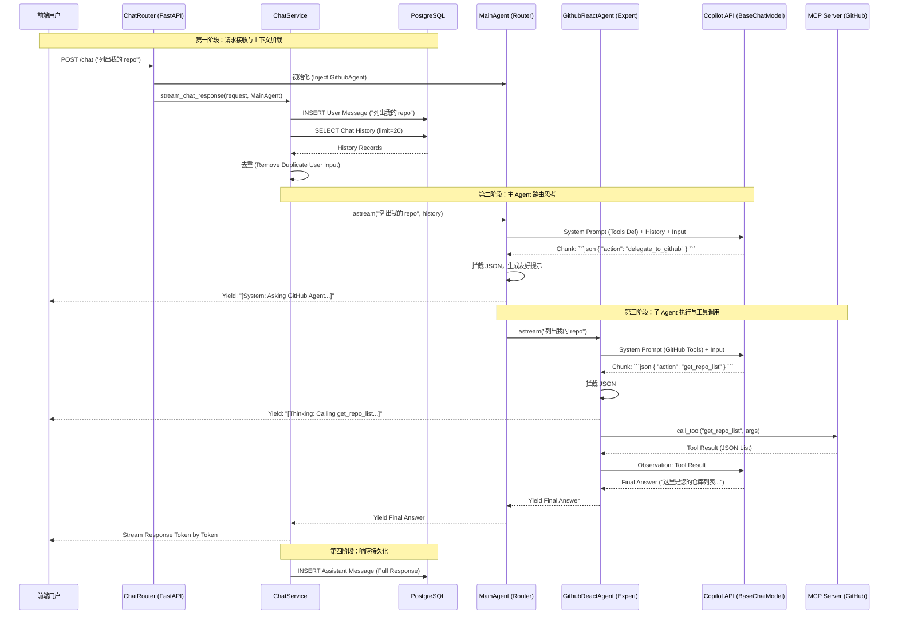

# 企业级 LLM 实战：在受限环境中基于 Copilot API 构建 ReAct MCP Agent

在银行等金融 IT 环境中，LLM 应用落地往往面临着严苛的限制。最典型的一道坎是：**我们只能使用公司内部提供的 LLM API（如 Copilot API），而这些 API 往往是不完整的。**

本文将复盘一次真实的架构演进：当我们的基础模型不支持标准的 Function Calling (`bind_tools`) 时，如何通过 **ReAct 模式** 和 **Model Context Protocol (MCP)**，手动构建一个强大的、支持工具调用的智能 Agent。

## 1. 交互全景图 (Architecture Overview)

在深入代码细节之前，让我们先通过一张时序图来俯瞰整个系统的请求流转过程。



## 2. 困境：当 `bind_tools` 失效

### 2.1 背景
我们基于公司提供的 Copilot API 封装了一个 LangChain `BaseChatModel`。基础的对话功能（`ainvoke`, `astream`）一切正常。

### 2.2 遭遇滑铁卢
当我们试图引入工具调用能力（Agentic Workflow）时，按照标准文档调用 `llm.bind_tools(tools)`，却收到了冷冰冰的错误：
`NotImplementedError`

原因在于：Copilot API（或其内部封装）并没有完全遵循 OpenAI 的 Function Calling 规范，或者我们的封装层无法透传这些参数。

**这意味着我们失去了一键构建 Agent 的能力。我们必须寻找另一条路。**

## 3. 破局：回归 ReAct 模式与核心组件设计

既然模型“不懂”原生工具调用，我们就教它用“人话”来调用工具。这正是 **ReAct (Reasoning + Acting)** 模式的精髓。

为了实现这一目标，我们设计了以下核心组件：

### 3.1 `McpToolConverter`: 协议适配器
**职责**：将 MCP 协议定义的工具（JSON Schema）转换为 LangChain 的 `StructuredTool`。这确保了我们的代码能够“读懂”MCP Server 提供的任何工具。

```python
# src/tools/mcp_tool_converter.py
class McpToolConverter:
    @staticmethod
    def convert(tool: McpTool) -> StructuredTool:
        # 动态创建 Pydantic Model，这是 LangChain 验证参数的基础
        fields = {}
        for name, prop in tool.inputSchema["properties"].items():
            # ... 解析类型和描述 ...
            fields[name] = (p_type, Field(description=desc))
        
        args_model = create_model(f"{tool.name}Schema", **fields)
        return StructuredTool.from_function(..., args_schema=args_model)
```

### 3.2 `ToolCallableAgent`: 抽象基类
**职责**：负责基础设施。它连接 MCP Server，获取工具列表，并负责生成能够“教”会 LLM 使用这些工具的 System Prompt。

**关键实现：手动构建工具 Prompt**
既然不能用 `bind_tools`，我们就把工具定义写进 System Prompt 里。

```python
# src/agents/tool_callable_agent.py
class ToolCallableAgent(BaseAgent):
    async def initialize(self):
        # 1. 连接 MCP Server
        # 2. 获取工具列表
        # 3. 生成 Prompt 描述
        self.tool_definitions = self._format_tool_definitions(self.tools)

    def _format_tool_definitions(self, tools: List[McpTool]) -> str:
        prompt_lines = ["You have access to the following tools:\n"]
        for tool in tools:
            schema = json.dumps(tool.inputSchema, indent=2)
            prompt_lines.append(f"Name: {tool.name}\nDescription: {tool.description}\nArguments: {schema}")
            
        prompt_lines.append("""
To use a tool, please output a JSON blob wrapped in markdown code block like this:
...json
{ "action": "tool_name", "action_input": { ... } }
...
""")
        return "\n".join(prompt_lines)
```

### 3.3 `GithubReactAgent`: 领域专家
**职责**：专注于 GitHub 相关任务。它继承自 `ToolCallableAgent`，实现了核心的 **ReAct Loop**。

**关键实现：手动解析与执行循环**
它不依赖 `AgentExecutor`，而是自己控制循环逻辑。

```python
# src/agents/github_react_agent.py
class GithubReactAgent(ToolCallableAgent):
    def _parse_tool_call(self, text: str) -> dict | None:
        # 正则提取 JSON
        json_match = re.search(r"```json\s*(\{.*?\})\s*```", text, re.DOTALL)
        return json.loads(json_match.group(1)) if json_match else None

    async def _agent_loop(self, messages: List) -> AsyncIterator[BaseMessageChunk]:
        """ReAct Loop: Think -> Parse -> Act -> Observe -> Think"""
        while turn < MAX_TURNS:
            # 1. Think
            async for chunk in self.llm_service.llm.astream(messages):
                yield chunk # 实时流式输出思考过程
            
            # 2. Parse & Act
            if tool_call := self._parse_tool_call(full_response):
                # 3. Observe
                tool_result = await self._execute_tool_ephemeral(tool_call['action'], tool_call['action_input'])
                messages.append(HumanMessage(content=f"Tool Output: {tool_result}"))
```

### 3.4 `MainAgent`: 智能路由器
**职责**：作为系统的单一入口，负责意图识别和任务分发。

**关键实现：动态路由与幻觉抑制**
它不直接执行业务逻辑，而是通过 `delegate_to_github` 这样的“元工具”将任务派发给 `GithubReactAgent`。我们在调试中发现它容易产生幻觉，因此对其进行了特别强化。

```python
# src/agents/main_agent.py
class MainAgent(BaseAgent):
    def __init__(self, llm_service, github_agent):
        self.tool_mapping = {
            "delegate_to_github": {"agent": github_agent, "name": "GitHub Agent"}
        }

    def _build_system_prompt(self) -> str:
        # 强指令防止幻觉
        return """You are a helpful assistant and a router.
CRITICAL INSTRUCTIONS:
1. You MUST ONLY use the tools listed above.
2. Do NOT invent or hallucinate new tools.
3. If the user request involves GitHub ..., MUST use `delegate_to_github`.
"""

    async def _astream_impl(self, input, chat_history):
        # ... (流式输出与 JSON 拦截逻辑) ...
        # 如果检测到 JSON Tool Call，拦截并替换为友好提示
        if tool_call:
            yield AIMessageChunk(content=f"\n[System: I will ask the {agent_name} to help...]\n")
            async for chunk in agent.astream(query):
                yield chunk
```

## 4. 进阶挑战：调试与修复

解决了“能用”的问题后，我们又遇到了“好用”的问题。

### 4.1 场景：分步提问引发的血案
用户先问：“列出我的 repo”，Agent 问：“你是谁？”，用户答：“nvd11”。
在这个过程中，我们遇到了两个严重问题：
1.  **重复提问**：Agent 似乎忘记了它问过什么，或者把用户的回答重复处理了。
2.  **幻觉**：Agent 在调用工具前，自己编造了一堆假的 repo 列表。

### 4.2 调试与修复

通过 **LangSmith Trace**，我们发现问题的根源在于我们手动实现的 Loop 和 Prompt 还不够严谨。

**修复一：历史记录去重**
我们的 `ChatService` 采用了“先存后读”的策略，导致最新的 User Input 在 `chat_history` 中出现了一次，作为 `input` 参数又出现了一次。模型看到两次 "nvd11"，逻辑就乱了。
*   **Fix**: 在读取历史记录后，如果最后一条与当前输入相同，手动移除它。

**修复二：幻觉抑制 (Thinking Suppression)**
模型太“热心”了，在输出 JSON 工具调用指令的同时，顺便把“结果”也编出来了。
*   **Fix 1 (Prompt)**: 在 `MainAgent` System Prompt 中加入 `CRITICAL INSTRUCTIONS`，严厉禁止 "invent or hallucinate new tools"。
*   **Fix 2 (Code)**: 在流式输出 (`astream`) 中引入**拦截机制**。一旦检测到 ` ```json ` 开始，就停止向用户输出后续文本。只在工具执行完毕后，由系统生成一条友好的 `[System: Calling GitHub...]` 提示。

## 5. 总结

在受限的企业级环境中，我们不能总是依赖最先进、最便捷的 API（如 OpenAI Function Calling）。但这并不意味着我们束手无策。

通过 **ReAct 模式**，我们用最原始的 Prompt Engineering 和正则解析，手动重建了 Agent 的思考回路。结合 **MCP 协议**，我们成功将这一能力扩展到了无限的外部工具。

这不仅是一个技术 workaround，更是一种对 LLM 原理深刻理解后的架构创新。它证明了：**只要模型具备基本的指令遵循能力（Instruction Following），我们就能构建出强大的 Agent 系统。**
