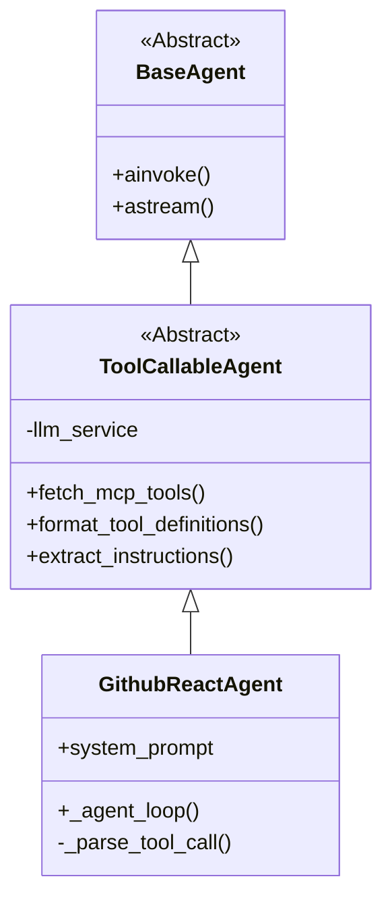

# 开发计划：Github React Agent (Prompt-Driven)

## 1. 背景与目标

由于部分企业级 LLM 环境（如 Copilot API）可能不支持标准的 `bind_tools` 接口，我们需要构建一个**不依赖 Function Calling API** 的 Agent 实现。
该 Agent 将采用经典的 **ReAct (Reasoning + Acting)** 模式，通过精心设计的 System Prompt 引导 LLM 输出结构化的 JSON 指令，从而实现工具调用。

## 2. 架构设计

我们将采用继承的方式复用现有逻辑，并引入一个新的抽象层。



### 2.1 核心组件

1.  **`ToolCallableAgent` (src/agents/tool_callable_agent.py)**
    *   **职责**: 处理所有与 MCP Server 的交互（连接、获取工具、获取指令）。
    *   **关键能力**: 提供 `format_tool_definitions(tools)` 方法，将工具列表转换为自然语言描述（JSON Schema 字符串），供 Prompt 使用。

2.  **`GithubReactAgent` (src/agents/github_react_agent.py)**
    *   **职责**: 实现 ReAct 循环。
    *   **Prompt 策略**:
        ```text
        You are a GitHub expert.
        You have access to the following tools:
        [Tool Definitions]

        To use a tool, please output a JSON blob wrapped in markdown:
        ```json
        {
          "action": "tool_name",
          "action_input": { ... }
        }
        ```
        ```

## 3. 开发步骤

### Step 1: 创建基类 `ToolCallableAgent`
*   将 `GithubAgent` 中关于 MCP 连接、工具获取、指令提取的代码抽取到这个基类中。
*   新增 `format_tools_to_prompt` 方法，用于生成 Prompt 中的工具描述部分。

### Step 2: 实现 `GithubReactAgent`
*   继承基类。
*   编写核心的 `_agent_loop`：
    1.  拼接 System Prompt。
    2.  流式调用 LLM。
    3.  **文本解析器**：实时检测输出流中是否包含 ` ```json ` 标记。
    4.  如果捕获到完整 JSON，解析并执行工具。
    5.  将工具结果作为 Observation 追加到历史，再次调用 LLM。

### Step 3: 验证
*   编写 `test/agents/test_github_react_agent.py`。
*   验证在不使用 `bind_tools` 的情况下，Agent 是否能正确解析 Prompt 并调用 `get_repo_list`。

## 4. 预期效果
该 Agent 将具备与原 `GithubAgent` 相同的业务能力，但具有**更强的兼容性**，可运行在任何支持文本生成的 LLM 上。
